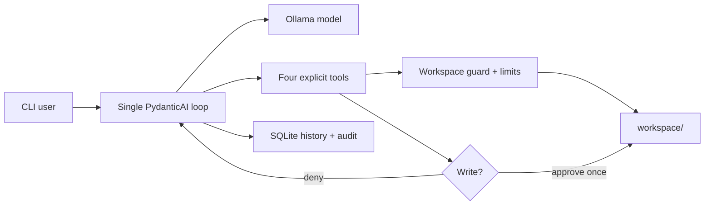

# Minimal Local Agent

[](https://github.com/MuzeAnisichael/minimal-local-agent/actions/workflows/ci.yml)
[](https://www.python.org/)
[](LICENSE)

**One local model, one agent loop, four bounded tools, and an audit trail.**

[简体中文](README.zh-CN.md)

Minimal Local Agent is a small, local-first reference implementation for building
useful AI agents without starting with a large orchestration stack. It runs an
Ollama model through PydanticAI, keeps conversation state in SQLite, and exposes
only workspace-scoped file tools.

> Status: early alpha. The safety boundaries are intentional, but local models can
> still make mistakes. Review every proposed write.

## Why this project?

Agent prototypes often become difficult to understand before they become useful.
This project keeps the first version deliberately small:

- **Single agent:** no router, planner hierarchy, or hidden sub-agents.
- **Local-first:** prompts, file contents, and history stay on the machine when
  Ollama is local.
- **Auditable:** runs and tool metadata are stored in one SQLite database.
- **Bounded:** relative paths only, fixed limits, no deletion, and no shell tool.
- **Replaceable:** the model, tools, and CLI are separated behind small interfaces.

## Features

- Ollama model access with native tool calling
- Interactive chat and one-shot CLI modes
- Persistent sessions and model-compatible message history
- Workspace-confined file listing, reading, plain-text search, and writing
- Per-call confirmation before every write; non-interactive writes are denied
- Atomic UTF-8 file writes and protection against path traversal
- Limits for turns, tool calls, output tokens, file size, and search breadth
- Local SQLite run log and tool audit events
- TOML configuration with `MLA_*` environment overrides
- Unit tests and a minimal GitHub Actions workflow

## Quick start

### Requirements

- Python 3.11 or newer
- [Ollama](https://ollama.com/) running locally
- A tool-capable Ollama model

The default model is `qwen3.5:9b`. Its quantized Ollama artifact is about 6.6 GB.
For machines with less available memory, use `qwen3.5:4b` instead.

### Windows PowerShell

```powershell
git clone https://github.com/MuzeAnisichael/minimal-local-agent.git
Set-Location minimal-local-agent
py -3.11 -m venv .venv
.\.venv\Scripts\Activate.ps1
python -m pip install -e ".[dev]"
ollama pull qwen3.5:9b
Copy-Item agent.example.toml agent.toml
minimal-agent doctor
minimal-agent chat
```

### macOS or Linux

```bash
git clone https://github.com/MuzeAnisichael/minimal-local-agent.git
cd minimal-local-agent
python3.11 -m venv .venv
source .venv/bin/activate
python -m pip install -e ".[dev]"
ollama pull qwen3.5:9b
cp agent.example.toml agent.toml
minimal-agent doctor
minimal-agent chat
```

If `qwen3.5:9b` is too slow or does not fit, change `model` in `agent.toml` and run:

```bash
ollama pull qwen3.5:4b
```

## Usage

Run one task:

```bash
minimal-agent run "Summarize the Markdown files in the workspace"
```

Start or resume an interactive session:

```bash
minimal-agent chat
minimal-agent chat --session 20260808-120000-a1b2c3
```

Inspect local history:

```bash
minimal-agent sessions
minimal-agent history 20260808-120000-a1b2c3
```

Machine-readable output:

```bash
minimal-agent run --json "Find references to TODO"
```

Put files the agent may access under `workspace/`. When the model requests a write,
the CLI shows the path, size, and overwrite flag, then asks for one-time approval.

## Architecture



The agent is the model plus instructions and tools. PydanticAI owns the bounded
tool-calling loop. Application code owns the security boundary, persistence, and
human confirmation. There is no autonomous background process.

### Available tools

| Tool | Side effect | Bounds |
|---|---:|---|
| `list_files` | No | Relative path, safe glob, result limit |
| `read_file` | No | UTF-8 text, file-size limit |
| `search_text` | No | Plain text only, file and match limits |
| `write_file` | Yes | Explicit approval, UTF-8, atomic write, size limit |

Deletion, shell execution, network requests, and arbitrary Python execution are not
available in v0.1.0.

## Configuration

Copy `agent.example.toml` to `agent.toml`. The local file is ignored by Git.

```toml
[agent]
model = "qwen3.5:9b"
base_url = "http://localhost:11434/v1"
request_limit = 6
tool_calls_limit = 8
max_output_tokens = 2048
temperature = 0.1

[paths]
workspace = "workspace"
database = ".minimal-local-agent/state.db"
```

Relative paths are resolved from the configuration file's directory. Every value
can be overridden for automation:

| Environment variable | Setting |
|---|---|
| `MLA_CONFIG` | Configuration file path |
| `MLA_MODEL` | Ollama model name |
| `MLA_BASE_URL` | Ollama OpenAI-compatible endpoint |
| `MLA_WORKSPACE` | Allowed workspace root |
| `MLA_DATABASE` | SQLite database path |
| `MLA_REQUEST_LIMIT` | Maximum model requests per run |
| `MLA_TOOL_CALLS_LIMIT` | Maximum successful tool calls per run |
| `MLA_MAX_OUTPUT_TOKENS` | Maximum output tokens per run |
| `MLA_TEMPERATURE` | Sampling temperature |
| `MLA_MAX_FILE_BYTES` | Per-file read/write limit |
| `MLA_MAX_LIST_RESULTS` | Maximum listed paths |
| `MLA_MAX_SEARCH_RESULTS` | Maximum search matches |
| `MLA_MAX_SEARCH_FILES` | Maximum files scanned per search |

## Security model

Model output is untrusted, even when the model runs locally. The runtime enforces
the following controls in ordinary Python code:

1. Absolute paths and traversal outside the configured workspace are rejected.
2. Existing symlinks are resolved before the workspace boundary is checked.
3. Reads, writes, searches, model turns, and tool calls have fixed limits.
4. Every write requires interactive approval and is denied when stdin is not a TTY.
5. Writes use a temporary file followed by an atomic replacement.
6. No tool can delete files, execute commands, or access the network.
7. Runs and tool metadata are recorded locally for later inspection.

Do not configure a home directory or another broad secret-bearing directory as the
workspace. See [SECURITY.md](SECURITY.md) for reporting and operational guidance.

## Local data

By default, generated state is not committed:

```text
.minimal-local-agent/state.db   # sessions, message history, audit metadata
workspace/                      # user-provided and agent-approved files
agent.toml                      # local configuration
```

The audit log records prompts, final responses, errors, usage, tool names, paths,
queries, counts, and statuses. It intentionally does not duplicate full file content
inside tool-event rows; model message history may contain content returned to the
model.

## Development

```bash
python -m pip install -e ".[dev]"
ruff check .
pytest
```

An Ollama server is not required for unit tests. Use `minimal-agent doctor` for the
local integration check.

### Repository layout

```text
minimal-local-agent/
├── .github/workflows/ci.yml
├── src/minimal_local_agent/
│   ├── agent.py       # model, instructions, tools, bounded loop
│   ├── cli.py         # run/chat/doctor/history commands
│   ├── config.py      # TOML and environment configuration
│   ├── security.py    # path boundary enforcement
│   ├── store.py       # SQLite history and audit log
│   └── workspace.py   # pure file operations
├── tests/
├── workspace/
├── agent.example.toml
├── CONTRIBUTING.md
├── SECURITY.md
└── pyproject.toml
```

## Roadmap

- Add streaming output without weakening auditability
- Add opt-in read-only MCP tools
- Add a small task-based evaluation suite for local models
- Add context compaction for long sessions
- Add an optional HTTP API after the CLI behavior stabilizes

Multi-agent orchestration, vector databases, shell access, and a web UI are not
roadmap defaults. They should be added only for a measured use case.

## License

[MIT](LICENSE)
