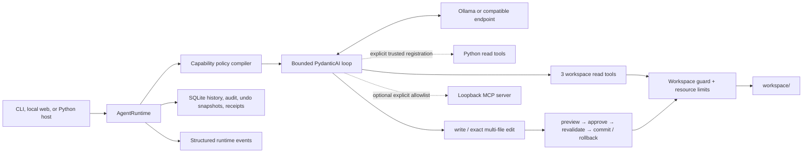

# Minimal Local Agent

[](https://github.com/MuzeAnisichael/minimal-local-agent/actions/workflows/ci.yml)
[](https://www.python.org/)
[](LICENSE)

**A minimal, auditable local-agent kernel: one model loop, explicit capabilities,
reversible edits, and no shell.**

[简体中文](README.zh-CN.md) · [Comparison](docs/COMPARISON.md) ·
[Validation](docs/VALIDATION.md) · [Roadmap](docs/ROADMAP.md) ·
[v1 compatibility](docs/COMPATIBILITY.md) · [Security](SECURITY.md)

Minimal Local Agent uses PydanticAI with Ollama by default or an explicitly
configured OpenAI Chat Completions-compatible endpoint. It confines file tools to
one workspace and persists sessions, audit events, reversible changes, and
hash-chained execution receipts in SQLite.

Version `1.0.0` is the stable release of this deliberately bounded kernel. Public
extension signatures and data compatibility are documented for 1.x. The runtime
enforces its boundaries in code; model output and configured MCP servers remain
untrusted inputs. Stable does not mean every provider/model behaves identically.

## Why it is different

Most agent systems optimize for more tools, channels, automation, or orchestration.
This project optimizes for a trust boundary that can be understood in one sitting:

- policy changes the actual model-visible tool schema, not only the prompt;
- multi-file edits are staged, diffed, approved once, revalidated, and rolled back
  as a transaction;
- every applied change can be inspected and safely undone while files remain
  unchanged;
- every run emits structured events and appends a hash-chained execution receipt;
- MCP is optional, loopback-only, prefixed, result-bounded, and requires an explicit
  per-server tool allowlist;
- shell execution, deletion, browser control, background daemons, and hidden
  sub-agents are absent from the core.

See the [project comparison](docs/COMPARISON.md) for the trade-offs relative to
smolagents, Qwen-Agent, nanobot, and Goose.

## v1.0 capabilities

| Area | Included |
|---|---|
| Runtime | Stable `AgentRuntime` embedding API, replaceable model factory, bounded agent loop |
| Context | Explicit per-request message-byte budget; opt-in reducer seam, no automatic compression |
| Models | Ollama by default; opt-in OpenAI Chat Completions-compatible endpoints |
| Interface | Local Web console and CLI; Web tasks are read-only or preview-only |
| Read tools | `list_files`, `read_file`, `search_text` |
| Mutation tools | `write_file`, transactional `edit_files` |
| Mutation safety | Unified diff, `confirm` / `preview` / `deny`, stale checks, rollback, undo |
| Policy | Per-tool allow/deny and mechanical removal from the tool surface |
| Observability | SQLite audit, JSONL runtime events, hash-chained execution receipts |
| Extensions | Explicit, audited Python read tools; optional allowlisted loopback MCP clients |
| Evaluation | Task-family summaries and deterministic answer, tool, and file assertions |

## Quick start

Requirements: Python 3.11+ and a configured model supporting tool calling. The
quick start below uses [Ollama](https://ollama.com/) as the default.

For a versioned install, download the wheel from the
[v1.0.0 release](https://github.com/MuzeAnisichael/minimal-local-agent/releases/tag/v1.0.0)
and run `python -m pip install minimal_local_agent-1.0.0-py3-none-any.whl` in a
virtual environment. No PyPI publication is assumed. Cloning below is convenient
for customization; check out `v1.0.0` before installation to pin that release.

### Windows PowerShell

```powershell
git clone https://github.com/MuzeAnisichael/minimal-local-agent.git
Set-Location minimal-local-agent
py -3.11 -m venv .venv
.\.venv\Scripts\Activate.ps1
python -m pip install -e .
ollama pull qwen3.5:9b
Copy-Item agent.example.toml agent.toml
minimal-agent doctor
minimal-agent chat
# Or open the local web console
minimal-agent web
```

### macOS or Linux

```bash
git clone https://github.com/MuzeAnisichael/minimal-local-agent.git
cd minimal-local-agent
python3.11 -m venv .venv
source .venv/bin/activate
python -m pip install -e .
ollama pull qwen3.5:9b
cp agent.example.toml agent.toml
minimal-agent doctor
minimal-agent chat
# Or open the local web console
minimal-agent web
```

Put only the files the agent may access under `workspace/`.

## Local web console

Start the browser-based workbench and open `http://127.0.0.1:8765`:

```bash
minimal-agent web
```

The web console supports read-only runs, non-writing change previews, session
history, runtime events, and receipt-chain status. It listens only on loopback and
does not expose confirmed file writes; use the interactive CLI when you want to
approve and apply a complete diff. It works on small screens, but is intended as a
local desktop interface, not a remotely exposed service.

The Web server accepts one active task at a time and returns HTTP 409 for overlap.
CLI/Python hosts must also serialize tasks sharing a workspace/database. Independent
workspaces should use independent databases.

## CLI

```bash
# One task or an interactive session
minimal-agent run "Summarize the Markdown files"
minimal-agent chat

# Remove mutation tools, or preview changes without applying them
minimal-agent run --read-only "Review this project"
minimal-agent run --dry-run "Rename the heading in README.md"

# Stream machine-readable events on stderr
minimal-agent run --events "Find the release notes"

# Inspect effective policy and audit state
minimal-agent capabilities
minimal-agent sessions
minimal-agent history SESSION_ID
minimal-agent audit SESSION_ID --json

# Inspect and undo an applied transaction
minimal-agent changes
minimal-agent change CHANGE_SET_ID
minimal-agent undo CHANGE_SET_ID

# Inspect and verify execution receipts
minimal-agent receipts SESSION_ID --json
minimal-agent verify SESSION_ID --head LAST_RECEIPT_HASH
```

An interactive write asks for one approval over the complete bounded diff.
Non-interactive confirmed writes are denied. `--dry-run` prints the same preview but
never modifies files.

## Architecture



PydanticAI owns model/tool iteration. Project code owns capability registration,
workspace enforcement, mutation transactions, policy, persistence, and receipts.
The model cannot add a tool or bypass a missing schema at runtime.

## Configuration

Copy `agent.example.toml` to the ignored local file `agent.toml`.

```toml
[agent]
provider = "ollama"
model = "qwen3.5:9b"
base_url = "http://localhost:11434/v1"
request_limit = 6
tool_calls_limit = 8
max_output_tokens = 2048
max_context_bytes = 64000 # serialized model-message bytes, not model tokens
temperature = 0.1
write_policy = "confirm" # "confirm", "preview", or "deny"

[paths]
workspace = "workspace"
database = ".minimal-local-agent/state.db"

[tools]
max_file_bytes = 200000
max_transaction_files = 8
max_diff_chars = 40000
max_mcp_result_chars = 100000

[policy.tools]
# search_text = "deny"
# edit_files = "preview"
# count_files = "deny" # A registered Python read tool.
```

`MLA_*` environment overrides are available for all scalar settings. Notable
examples are `MLA_PROVIDER`, `MLA_MODEL`, `MLA_BASE_URL`, `MLA_API_KEY_ENV`,
`MLA_WORKSPACE`, `MLA_DATABASE`,
`MLA_WRITE_POLICY`, `MLA_DISABLED_TOOLS`, and each `MLA_MAX_*` limit. Relative paths
are resolved from the configuration file directory.

Configuration precedence is defaults → TOML → environment. Unknown TOML keys and
incorrect types are rejected instead of silently ignored. Correct v0.9 settings
remain valid. See the [compatibility and upgrade guide](docs/COMPATIBILITY.md)
before updating an existing SQLite database; back it up while no runs are active.

### Other model endpoints

For a local server, an official API, or a relay exposing the OpenAI Chat
Completions protocol, change only your ignored `agent.toml`:

```toml
[agent]
provider = "openai-compatible"
model = "your-tool-capable-model"
base_url = "https://your-provider.example/v1"
api_key_env = "MODEL_API_KEY"
```

Set `MODEL_API_KEY` in your local environment, then run `minimal-agent doctor` and
a read-only task. `api_key_env` is the variable **name**, never the secret. For a
keyless local compatible server, omit it and use a loopback/private-network URL.
Remote endpoints require a key and keyed endpoints require HTTPS outside
loopback. `doctor` checks `/models` without making a generation request; services
without a model-list endpoint may show “unverified” until a task succeeds.

This adapter targets Chat Completions and tool calling, not every provider-specific
extension. A provider or model without compatible tool calls may fail a task.
Keep real addresses, keys, and personal default models only in local ignored
configuration or environment variables. Using a remote endpoint sends prompts
and tool results—including workspace content read by the agent—to that service.

Write tools can be `ask`, `preview`, or `deny`; they can never be configured to
bypass approval. Read and external-read tools can be `allow` or `deny`.

### Context budget

`max_context_bytes` limits the UTF-8 JSON size of model-bound messages before
**every** model request, including requests following a tool result. It is a
portable guard, **not** an exact token count or a guarantee that a provider's
context window will fit; tool schemas and provider-specific framing are not counted.
When the limit is exceeded, the run fails clearly and records the size and hash in
its receipt. The saved conversation remains intact; start a new session or change
the limit. `MLA_MAX_CONTEXT_BYTES` overrides the local TOML setting.

Trusted Python hosts may explicitly pass `context_reducer=` to `AgentRuntime` for
future compression strategies. The reducer receives the model-bound messages and
the byte limit, must preserve the latest message unchanged, and must return a view
under the limit. Reduced-view hashes are recorded, while the original full history
is still persisted. No reducer is loaded from configuration or enabled by default.
Custom reducers must preserve valid tool-call/result pairs.

## Python read-tool extension

Run the included example after configuring a tool-capable model:

```bash
python examples/read_tool.py
```

It registers `ReadTool("count_files", count_files)` with `AgentRuntime` and runs
read-only. To host the same tool in the local Web console, pass it explicitly to
`serve_web(settings, read_tools=(ReadTool("count_files", count_files),))` from a
Python script. No Agent core edit or config-driven code import is needed.

`[policy.tools] count_files = "deny"` removes it from the model-visible schema.
Allowed calls are bounded by the existing `max_mcp_result_chars` external-result
limit and recorded with argument names/hashes and result size/hash, not full
arguments or results, in audit and receipts. Model conversation history can still
contain the full result. `ReadTool` is a **trusted-code declaration, not a Python
sandbox**: register only functions you have reviewed and that perform reads.

For the complete example, see [examples/read_tool.py](examples/read_tool.py).
The old `AgentRuntime(toolsets=..., external_tools=...)` escape hatch was removed
because it bypassed the policy/audit path; migrate to `read_tools=(ReadTool(...),)`.

## Optional MCP client

Install the optional client and configure a trusted local endpoint:

```bash
python -m pip install -e ".[mcp]"
```

```toml
[[mcp.servers]]
name = "notes"
url = "http://127.0.0.1:8000/mcp"
allow_tools = ["search_notes", "read_note"]

[policy.tools]
mcp_notes_read_note = "deny"
```

The model sees prefixed names such as `mcp_notes_search_notes`. The MCP client accepts only
`localhost`, `127.0.0.1`, or `::1` HTTP endpoints. Server instructions, sampling,
elicitation, filesystem roots, implicit tool exposure, and remote URLs are disabled.
Tool results have a size limit; audit records store argument names and hashes rather
than full arguments.

An allowlist is a local operator assertion that those tools are read-only. MCP tool
annotations and server content are not a security boundary; use only servers you
trust and keep their allowlist narrow.

## Embedding API and events

```python
from minimal_local_agent import AgentRuntime, Settings

runtime = AgentRuntime(Settings.load("agent.toml"))
outcome = runtime.run(
    "Summarize fact.txt",
    event_handler=lambda event: print(event.to_dict()),
)
print(outcome.response)
print(outcome.receipt_hash)
```

Runtime event types include `run.started`, `tool.completed`, `mutation.preview`,
`mutation.applied`, `run.completed`, and `run.failed`. The model construction
boundary is replaceable through `model_factory`; trusted host-owned read tools can
be passed explicitly to `AgentRuntime`. Observer callback failures do not alter the
agent run and are returned in `outcome.event_handler_errors`.
The [v1 compatibility contract](docs/COMPATIBILITY.md) defines the supported host
API, configuration, database upgrades, and data formats.

Execution receipts contain hashes of the endpoint, prompt, and response, plus usage,
the effective capability manifest, and audit-safe tool metadata. They form a
per-session hash chain. Internal verification detects broken links or content changed
without recomputing hashes. Saving the last hash outside SQLite and passing it with
`verify --head` also detects a rewritten or truncated chain. Without an external
head, a database writer can recompute the chain. Receipts are not identity or remote
attestation.

## Evaluation datasets

Run the built-in isolated list/read/search checks:

```bash
minimal-agent eval --model qwen3:4b --model qwen3:8b
```

Run a versioned external dataset:

```bash
minimal-agent eval --dataset evals/adversarial.json --model qwen3:8b
```

The JSON schema identifier remains `minimal-local-agent.eval-dataset.v1`. Cases can
declare a `family`, isolated fixture `files`, expected tool/status/answer, forbidden
tools, exact `expected_files`, and `absent_files`. File assertions check the real
isolated workspace, not the model's claim. Reports group cases by family and show
success rate plus total-attempt latency and tokens per successful case. JSON reports
use `minimal-local-agent.eval-report.v1` and include the runtime version, provider,
and fixed budgets. Missing or all-zero usage makes the token metric `null` / `n/a`;
it is not a money price. This is a compatibility and regression harness, not a
general intelligence benchmark. See the [release results](evals/results/v1.0.json).

## Security boundary

The runtime enforces:

1. relative paths confined to one resolved workspace, including symlink checks;
2. fixed message-byte, model, tool-call, output, file, search, transaction, diff,
   and MCP limits;
3. mechanical tool removal for denied capabilities;
4. exact unique edits, optional source hashes, and stale checks;
5. one combined diff before any mutation, followed by atomic writes and rollback;
6. undo only when current hashes still match the applied transaction;
7. no built-in shell, process execution, deletion tool, browser, or remote MCP;
8. local history, audit metadata, structured events, and verifiable receipts.

SQLite message history can contain file contents returned to the model. Reversible
change snapshots contain prior file text. Protect the database accordingly. Never
set the workspace to a home directory or another broad secret-bearing directory.
See [SECURITY.md](SECURITY.md) for the complete threat boundary.

## Development

```bash
python -m pip install -e ".[dev,mcp]"
ruff format --check .
ruff check .
pytest
```

Unit tests do not require Ollama. `minimal-agent doctor` checks the live endpoint;
`minimal-agent eval` exercises a real local model.

```text
minimal-local-agent/
|-- src/minimal_local_agent/
|   |-- agent.py       # bounded loop and AgentRuntime
|   |-- context.py     # per-request budget and explicit reducer seam
|   |-- read_tools.py  # Python read-tool declarations and audit
|   |-- models.py      # Ollama and compatible endpoint factories
|   |-- web.py         # loopback-only Web API
|   |-- web_assets/    # dependency-free local interface
|   |-- mutations.py   # transactional edits and undo
|   |-- policy.py      # capability compiler
|   |-- mcp.py         # optional guarded MCP clients
|   |-- events.py      # structured runtime events
|   |-- store.py       # migrations, audit, receipts
|   `-- evals.py       # versioned evaluation harness
|-- evals/             # reusable evaluation datasets
|-- examples/          # minimal host-side extension example
|-- scripts/           # clean distribution/install smoke check
|-- tests/
|-- docs/
`-- agent.example.toml
```

## Deliberate non-goals

The core does not aim to become a universal assistant. Shell/browser tools,
semantic memory, scheduling, autonomous background work, and multi-agent
orchestration remain outside v1.0. The [roadmap](docs/ROADMAP.md) prioritizes
maintenance and small host-owned adapters, not a larger default tool surface.

## License

[MIT](LICENSE)
