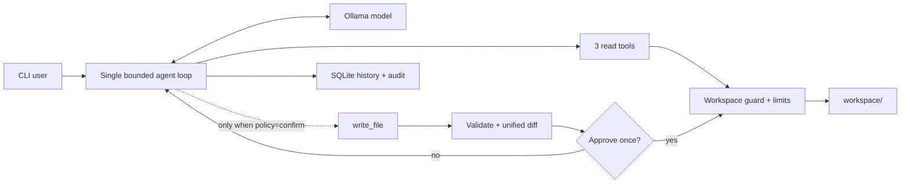

# Minimal Local Agent

[](https://github.com/MuzeAnisichael/minimal-local-agent/actions/workflows/ci.yml)
[](https://www.python.org/)
[](LICENSE)

**One local model, one agent loop, three read tools, and one optional confirmed write tool.**

[简体中文](README.zh-CN.md) · [Comparison](docs/COMPARISON.md) · [Validation](docs/VALIDATION.md) · [Security](SECURITY.md)

Minimal Local Agent is a compact reference architecture for local AI agents. It
runs an Ollama model through PydanticAI, confines tools to one workspace, persists
sessions and audit events in SQLite, and makes its side-effect policy explicit.

> Status: alpha. The boundaries are enforced in code, but model output remains
> untrusted. Keep the workspace narrow and inspect proposed writes.

## Why this project?

Most local-agent projects optimize for breadth: shell access, browser tools,
channels, plugins, memory layers, or multi-agent orchestration. Those are useful,
but they make the first security and debugging boundary harder to see.

This project optimizes for a different goal: **the smallest useful agent whose
capabilities, changes, and tool behavior are easy to verify.**

- A read-only run does not merely tell the model not to write; `write_file` is not
  registered at all.
- A write is validated first, shown as a bounded unified diff, approved once, and
  checked again before replacement.
- Tool calls are queryable or exportable from SQLite.
- A built-in read-only evaluation checks whether an installed model actually uses
  the expected tools and returns the expected evidence.
- There is no shell, deletion, network tool, hidden sub-agent, or background daemon.

See the [side-by-side analysis](docs/COMPARISON.md) with smolagents, Qwen-Agent,
nanobot, and Goose.

## Features

- Ollama model access with native tool calling
- One-shot and interactive CLI modes
- Persistent sessions and model-compatible history
- Workspace-scoped listing, reading, text search, and optional writing
- Strict read-only policy that removes the write capability
- Diff-first, per-call confirmation with visible line endings; non-interactive
  writes are denied
- Atomic UTF-8 replacement and path-traversal protection
- Limits for requests, tool calls, output, file size, and search breadth
- SQLite run history plus inspectable tool audit events
- Three-case local model evaluation for list/read/search tool use
- TOML configuration with `MLA_*` environment overrides
- Python 3.11/3.12 CI and unit tests that do not require Ollama

## Quick start

Requirements: Python 3.11+, a running [Ollama](https://ollama.com/) server, and an
installed model that supports tool calling.

### Windows PowerShell

```powershell
git clone https://github.com/MuzeAnisichael/minimal-local-agent.git
Set-Location minimal-local-agent
py -3.11 -m venv .venv
.\.venv\Scripts\Activate.ps1
python -m pip install -e ".[dev]"
ollama pull qwen3.5:9b
Copy-Item agent.example.toml agent.toml
minimal-agent doctor
minimal-agent chat
```

### macOS or Linux

```bash
git clone https://github.com/MuzeAnisichael/minimal-local-agent.git
cd minimal-local-agent
python3.11 -m venv .venv
source .venv/bin/activate
python -m pip install -e ".[dev]"
ollama pull qwen3.5:9b
cp agent.example.toml agent.toml
minimal-agent doctor
minimal-agent chat
```

Change `model` in `agent.toml` when using another installed Ollama model.

## Usage

Place files the agent may inspect under `workspace/`.

Run one task:

```bash
minimal-agent run "Summarize the Markdown files in the workspace"
```

Remove the write capability for one run or chat:

```bash
minimal-agent run --read-only "Review these files and suggest improvements"
minimal-agent chat --read-only
```

Start or resume a session:

```bash
minimal-agent chat
minimal-agent chat --session 20260808-120000-a1b2c3
```

Inspect runs and tool events:

```bash
minimal-agent sessions
minimal-agent history 20260808-120000-a1b2c3
minimal-agent audit 20260808-120000-a1b2c3
minimal-agent audit 20260808-120000-a1b2c3 --json
```

Compare installed local models with isolated, read-only checks:

```bash
minimal-agent eval --model qwen3:4b --model qwen3:8b
minimal-agent eval --model qwen3:8b --json
```

Each model must call the expected `list_files`, `read_file`, and `search_text` tool
and return the expected value. The command exits non-zero if any case fails. This is
a fast compatibility check, not a general intelligence benchmark. Runs use the
same read-only policy, temperature `0`, four-request/four-tool limits, and a 4096
output-token budget so model comparisons do not inherit unrelated task settings.

## Architecture



PydanticAI owns the bounded model/tool loop. Application code owns capability
registration, filesystem enforcement, confirmation, and persistence. The model
cannot add tools at runtime.

### Tool surface

| Tool | Side effect | Runtime bounds |
|---|---:|---|
| `list_files` | No | Relative directory, recursive, result limit |
| `read_file` | No | UTF-8 text, file-size limit |
| `search_text` | No | Recursive plain-text search, file and match limits |
| `write_file` | Yes | Optional registration, diff, approval, atomic write |

Deletion, shell execution, arbitrary Python execution, and network requests are
not exposed as tools.

## Configuration

Copy `agent.example.toml` to `agent.toml`; the local file is ignored by Git.

```toml
[agent]
model = "qwen3.5:9b"
base_url = "http://localhost:11434/v1"
request_limit = 6
tool_calls_limit = 8
max_output_tokens = 2048
temperature = 0.1
write_policy = "confirm" # "confirm" or "deny"

[paths]
workspace = "workspace"
database = ".minimal-local-agent/state.db"

[tools]
max_file_bytes = 200000
max_list_results = 200
max_search_results = 100
max_search_files = 500
```

Relative paths are resolved from the configuration file's directory.

| Environment variable | Setting |
|---|---|
| `MLA_CONFIG` | Configuration file path |
| `MLA_MODEL` | Ollama model name |
| `MLA_BASE_URL` | Ollama OpenAI-compatible endpoint |
| `MLA_WORKSPACE` | Allowed workspace root |
| `MLA_DATABASE` | SQLite database path |
| `MLA_WRITE_POLICY` | `confirm` or `deny` |
| `MLA_REQUEST_LIMIT` | Maximum model requests per run |
| `MLA_TOOL_CALLS_LIMIT` | Maximum tool calls per run |
| `MLA_MAX_OUTPUT_TOKENS` | Maximum output tokens per run |
| `MLA_TEMPERATURE` | Sampling temperature |
| `MLA_MAX_FILE_BYTES` | Per-file read/write limit |
| `MLA_MAX_LIST_RESULTS` | Maximum listed paths |
| `MLA_MAX_SEARCH_RESULTS` | Maximum search matches |
| `MLA_MAX_SEARCH_FILES` | Maximum files scanned per search |

## Security model

Model output is untrusted even when inference is local. The runtime enforces:

1. Relative paths confined to one configured workspace.
2. Symlink resolution before the workspace boundary check.
3. Fixed model, tool, output, file, and search limits.
4. Mechanical removal of `write_file` under the `deny` policy.
5. Validation and a bounded unified diff before each write approval.
6. Automatic denial when stdin is not interactive.
7. Revalidation and same-directory atomic replacement after approval.
8. No delete, shell, Python, or network tool.
9. Local run and tool-event records for later inspection.

Do not configure a home directory or another broad secret-bearing directory as the
workspace. A remote Ollama URL moves prompts and tool results outside the local
privacy boundary. See [SECURITY.md](SECURITY.md).

## Local data and audit scope

```text
.minimal-local-agent/state.db   # sessions, history, run and tool metadata
workspace/                      # user data and approved outputs
agent.toml                      # local configuration
```

Tool-event rows include names, statuses, paths, queries, counts, byte sizes, and a
diff hash. They do not duplicate full file contents. Model message history can
contain content returned by read tools.

## Development

```bash
python -m pip install -e ".[dev]"
ruff format --check .
ruff check .
pytest
```

Ollama is not required for unit tests. Use `minimal-agent doctor` for connectivity
and `minimal-agent eval` for real model/tool integration.

### Repository layout

```text
minimal-local-agent/
├── .github/workflows/ci.yml
├── docs/
│   ├── COMPARISON.md
│   ├── COMPARISON.zh-CN.md
│   └── VALIDATION.md
├── src/minimal_local_agent/
│   ├── agent.py       # instructions, capability registry, bounded loop
│   ├── cli.py         # run/chat/audit/eval commands
│   ├── config.py      # TOML, environment, policies
│   ├── evals.py       # isolated local-model checks
│   ├── security.py    # path boundary enforcement
│   ├── store.py       # SQLite history and audit events
│   └── workspace.py   # file operations and diff preview
├── tests/
├── workspace/
├── agent.example.toml
├── CHANGELOG.md
├── CONTRIBUTING.md
├── SECURITY.md
└── pyproject.toml
```

## Deliberate limits and roadmap

The project does not try to replace full agent platforms. It currently lacks
streaming, a GUI, MCP, browser/shell tools, long-term semantic memory, and
multi-agent orchestration.

Near-term work should preserve the small trust boundary:

- broader adversarial and multilingual local-model evaluation;
- streaming without losing complete audit records;
- context compaction for long sessions;
- an opt-in, read-only MCP adapter with an explicit allowlist;
- patch-oriented edits after the full-file write path is proven stable.

Large dependencies and powerful tools should be added only when a measured use
case justifies their security and maintenance cost.

## License

[MIT](LICENSE)
