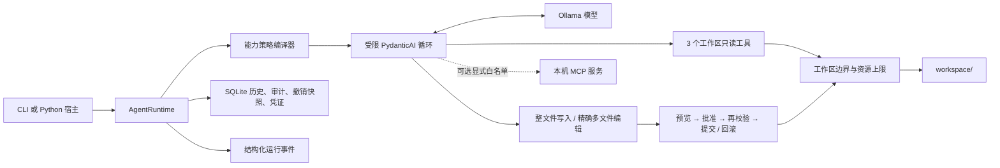

# Minimal Local Agent

**一个极简、可审计的本地 Agent 内核：单模型循环、显式能力、可撤销编辑，并且没有 Shell。**

[English](README.md) · [同类项目对比](docs/COMPARISON.zh-CN.md) ·
[验证记录](docs/VALIDATION.md) · [安全策略](SECURITY.md)

Minimal Local Agent 通过 PydanticAI 调用 Ollama，将文件工具限制在一个工作区内，并用
SQLite 保存会话、审计事件、可撤销变更和哈希链执行凭证。

当前版本为 `0.5.0` Alpha。边界由运行时代码执行；模型输出和配置的 MCP 服务仍应视为
不可信输入。

## 核心差异

- 策略会改变模型实际可见的工具 schema，而不只是修改提示词。
- 多文件编辑先整体暂存和展示 diff，只批准一次，再校验并以事务方式提交或回滚。
- 已应用变更可查看、可撤销；如果文件后来被修改，撤销会安全拒绝。
- 每次运行都会产生结构化事件和哈希链执行凭证。
- MCP 为可选能力，只允许回环地址、显式工具白名单、名称前缀和结果大小限制。
- 核心不提供 Shell、删除、浏览器控制、后台守护进程和隐藏子 Agent。

更完整的取舍见[同类项目对比](docs/COMPARISON.zh-CN.md)。

## v0.5 能力

| 范围 | 已实现 |
|---|---|
| 运行时 | 稳定的 `AgentRuntime` API、可替换模型工厂、受限单 Agent 循环 |
| 只读工具 | `list_files`、`read_file`、`search_text` |
| 变更工具 | `write_file`、事务式 `edit_files` |
| 变更安全 | 统一 diff、确认/预览/拒绝、陈旧检查、回滚、撤销 |
| 策略 | 逐工具 allow/deny，拒绝能力从工具面机械移除 |
| 可观测性 | SQLite 审计、JSONL 事件、哈希链执行凭证 |
| 扩展 | 可选、显式白名单的本机 HTTP MCP 客户端 |
| 评测 | 内置模型冒烟测试和外部版本化 JSON 数据集 |

## 快速开始

需要 Python 3.11+、正在运行的 [Ollama](https://ollama.com/) 和支持工具调用的模型。

### Windows PowerShell

```powershell
git clone https://github.com/MuzeAnisichael/minimal-local-agent.git
Set-Location minimal-local-agent
py -3.11 -m venv .venv
.\.venv\Scripts\Activate.ps1
python -m pip install -e ".[dev]"
ollama pull qwen3.5:9b
Copy-Item agent.example.toml agent.toml
minimal-agent doctor
minimal-agent chat
```

### macOS / Linux

```bash
git clone https://github.com/MuzeAnisichael/minimal-local-agent.git
cd minimal-local-agent
python3.11 -m venv .venv
source .venv/bin/activate
python -m pip install -e ".[dev]"
ollama pull qwen3.5:9b
cp agent.example.toml agent.toml
minimal-agent doctor
minimal-agent chat
```

只把允许 Agent 访问的文件放入 `workspace/`。

## 常用命令

```bash
# 单次任务或交互会话
minimal-agent run "总结工作区中的 Markdown 文件"
minimal-agent chat

# 移除变更工具，或只预览不落盘
minimal-agent run --read-only "审查这个项目"
minimal-agent run --dry-run "修改 README.md 标题"

# 在 stderr 输出 JSONL 运行事件
minimal-agent run --events "查找发布说明"

# 查看真实生效的能力与审计记录
minimal-agent capabilities
minimal-agent sessions
minimal-agent history SESSION_ID
minimal-agent audit SESSION_ID --json

# 查看和撤销一次文件事务
minimal-agent changes
minimal-agent change CHANGE_SET_ID
minimal-agent undo CHANGE_SET_ID

# 查看并校验执行凭证链
minimal-agent receipts SESSION_ID --json
minimal-agent verify SESSION_ID --head LAST_RECEIPT_HASH
```

交互式写入会对完整且有上限的 diff 请求一次批准；非交互环境会自动拒绝确认式写入。
`--dry-run` 展示同样的 diff，但绝不修改文件。

## 架构



PydanticAI 负责模型和工具迭代；本项目代码负责能力注册、工作区边界、变更事务、策略、
持久化与凭证。模型无法在运行时自行增加工具或绕过缺失的 schema。

## 配置

复制 `agent.example.toml` 为被 Git 忽略的 `agent.toml`：

```toml
[agent]
model = "qwen3.5:9b"
base_url = "http://localhost:11434/v1"
request_limit = 6
tool_calls_limit = 8
max_output_tokens = 2048
temperature = 0.1
write_policy = "confirm" # "confirm"、"preview" 或 "deny"

[paths]
workspace = "workspace"
database = ".minimal-local-agent/state.db"

[tools]
max_file_bytes = 200000
max_transaction_files = 8
max_diff_chars = 40000
max_mcp_result_chars = 100000

[policy.tools]
# search_text = "deny"
# edit_files = "preview"
```

所有标量配置都支持 `MLA_*` 环境变量覆盖，常用项包括 `MLA_MODEL`、
`MLA_BASE_URL`、`MLA_WORKSPACE`、`MLA_DATABASE`、`MLA_WRITE_POLICY`、
`MLA_DISABLED_TOOLS` 和各个 `MLA_MAX_*` 上限。相对路径以配置文件目录为基准。

写工具只能是 `ask`、`preview` 或 `deny`，不能配置成绕过批准；只读和外部只读工具只能
是 `allow` 或 `deny`。

## 可选 MCP 客户端

```bash
python -m pip install -e ".[mcp]"
```

```toml
[[mcp.servers]]
name = "notes"
url = "http://127.0.0.1:8000/mcp"
allow_tools = ["search_notes", "read_note"]

[policy.tools]
mcp_notes_read_note = "deny"
```

模型看到的是 `mcp_notes_search_notes` 这类带前缀名称。v0.5 只接受 `localhost`、
`127.0.0.1` 或 `::1`；关闭服务端指令、采样、交互请求、文件系统根目录、隐式工具暴露和
远程 URL。工具结果有大小上限，审计仅保存参数名和参数哈希，不保存完整参数。

白名单代表操作者确认这些工具是只读的。MCP 注解和服务端内容本身不是安全边界，因此只应
连接可信本机服务，并保持最小白名单。

## Python 嵌入与事件

```python
from minimal_local_agent import AgentRuntime
from minimal_local_agent.config import Settings

runtime = AgentRuntime(Settings.load("agent.toml"))
outcome = runtime.run(
    "总结 fact.txt",
    event_handler=lambda event: print(event.to_dict()),
)
print(outcome.response)
print(outcome.receipt_hash)
```

v0.5 事件包括 `run.started`、`tool.completed`、`mutation.preview`、
`mutation.applied`、`run.completed` 和 `run.failed`。宿主可通过 `model_factory` 替换模型
构造，也可显式传入自己的工具集。观察回调失败不会改变 Agent 运行语义，错误会出现在
`outcome.event_handler_errors` 中。

执行凭证记录端点/提示词/回复哈希、用量、有效能力清单和适合审计的工具元数据，并按会话
组成哈希链。内部校验能发现断链或未重算哈希的内容修改；把最后一个哈希另存到 SQLite
之外，再用 `verify --head` 校验，还能发现整链重写或截断。如果没有外部 head，能够写数据库
的人也能重算整条链。凭证不等同于数字身份或远程证明。

## 模型评测

```bash
# 内置 list/read/search 隔离测试
minimal-agent eval --model qwen3:4b --model qwen3:8b

# 外部版本化数据集
minimal-agent eval --dataset evals/adversarial.json --model qwen3:8b
```

JSON schema 标识为 `minimal-local-agent.eval-dataset.v1`。每个用例可创建隔离文件，并声明
预期工具、状态、回复片段和禁止工具。它是兼容性与回归测试，不是通用智能排行榜。

## 安全边界

运行时强制执行：

1. 所有相对路径都限制在一个解析后的工作区，包含符号链接检查；
2. 模型请求、工具调用、输出、文件、搜索、事务、diff 和 MCP 结果都有上限；
3. 被拒绝的能力从模型工具表中机械移除；
4. 精确唯一替换、可选源文件哈希和陈旧状态检查；
5. 变更前展示统一 diff，随后原子写入，失败时回滚；
6. 只有当前文件哈希仍匹配时才允许撤销；
7. 内核没有 Shell、进程执行、删除工具、浏览器或远程 MCP；
8. 本地保存历史、审计元数据、结构化事件与可校验凭证。

SQLite 消息历史可能包含模型读过的文件内容；撤销快照会保存变更前文本，请保护数据库。
不要把用户主目录或包含密钥的宽泛目录设置为工作区。详见 [SECURITY.md](SECURITY.md)。

## 开发

```bash
python -m pip install -e ".[dev,mcp]"
ruff format --check .
ruff check .
pytest
```

单元测试不需要 Ollama；`minimal-agent doctor` 检查真实服务，`minimal-agent eval` 测试真实
本地模型。

## 有意不做的事情

核心不以“万能个人助理”为目标。Shell/浏览器工具、GUI、语义记忆、定时调度、后台自治和
多 Agent 编排不属于 v0.5。后续更适合优先增强凭证签名/导出、上下文压缩、确定性安全评测，
以及不扩大默认信任边界的适配器扩展。

## License

[MIT](LICENSE)
