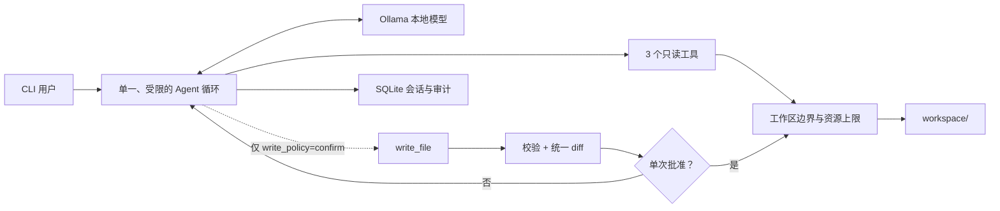

# Minimal Local Agent

**一个本地模型、一个 Agent 循环、三个只读工具，以及一个可选的确认式写入工具。**

[English](README.md) · [同类项目对比](docs/COMPARISON.zh-CN.md) · [验证记录](docs/VALIDATION.md) · [安全策略](SECURITY.md)

Minimal Local Agent 是一个极简、可审计的本地 Agent 参考架构。它通过
PydanticAI 调用 Ollama，用 SQLite 保存会话和审计记录，并把工具严格限制在
一个工作区内。

> 当前为 Alpha 版本。安全边界由代码执行，但模型输出仍是不可信输入。

## 核心定位

许多本地 Agent 项目优先扩展 Shell、浏览器、聊天渠道、插件、记忆和多 Agent。
本项目选择另一条路线：**先做出能力、改动和工具行为都容易验证的最小可用
Agent，再按真实需求扩展。**

- 只读模式不是靠提示词约束，而是完全不向模型注册 `write_file`。
- 写入前先校验路径和大小，再展示统一 diff，并且只允许单次确认。
- 会话、运行结果和工具事件都可从 SQLite 查询或导出。
- 内置隔离、只读的本地模型评测，验证模型是否真的调用了预期工具。
- 默认没有 Shell、删除、网络、后台进程或隐藏子 Agent。

完整分析见[同类项目对比](docs/COMPARISON.zh-CN.md)。

## 功能

- Ollama 本地模型与原生工具调用
- 单次任务和交互式 CLI
- 持久化会话及模型消息历史
- 工作区内的文件列表、读取、文本搜索和可选写入
- 真正移除写入能力的只读策略
- 写入前统一 diff（显式标注换行差异）、逐次确认和非交互环境自动拒绝
- UTF-8 原子写入、路径穿越与工作区越界防护
- 模型请求、工具调用、输出、文件和搜索范围上限
- SQLite 运行历史与工具审计
- 面向本地模型的 list/read/search 三项快速评测
- TOML 配置、`MLA_*` 环境变量覆盖、Python 3.11/3.12 CI

## 快速开始

需要 Python 3.11+、本地运行的 [Ollama](https://ollama.com/)，以及支持工具调用的
模型。

### Windows PowerShell

```powershell
git clone https://github.com/MuzeAnisichael/minimal-local-agent.git
Set-Location minimal-local-agent
py -3.11 -m venv .venv
.\.venv\Scripts\Activate.ps1
python -m pip install -e ".[dev]"
ollama pull qwen3.5:9b
Copy-Item agent.example.toml agent.toml
minimal-agent doctor
minimal-agent chat
```

### macOS / Linux

```bash
git clone https://github.com/MuzeAnisichael/minimal-local-agent.git
cd minimal-local-agent
python3.11 -m venv .venv
source .venv/bin/activate
python -m pip install -e ".[dev]"
ollama pull qwen3.5:9b
cp agent.example.toml agent.toml
minimal-agent doctor
minimal-agent chat
```

如果使用其他已安装模型，修改 `agent.toml` 中的 `model`。

## 使用方式

把允许 Agent 访问的文件放入 `workspace/`。

```bash
# 单次任务
minimal-agent run "总结工作区中的 Markdown 文件"

# 只读运行：模型根本看不到 write_file
minimal-agent run --read-only "审查这些文件并提出改进建议"
minimal-agent chat --read-only

# 会话与历史
minimal-agent chat
minimal-agent sessions
minimal-agent history 20260808-120000-a1b2c3

# 查看或导出工具审计
minimal-agent audit 20260808-120000-a1b2c3
minimal-agent audit 20260808-120000-a1b2c3 --json

# 对比本机模型的工具使用能力
minimal-agent eval --model qwen3:4b --model qwen3:8b
minimal-agent eval --model qwen3:8b --json
```

评测要求每个模型真正成功调用 `list_files`、`read_file`、`search_text`，并返回
正确证据。任何一项失败都会产生非零退出码。它是快速兼容性检查，不是通用能力
排行榜。所有模型统一使用只读策略、温度 `0`、最多四次请求/四次工具调用和 4096
输出 token，避免继承无关的任务参数。

## 架构



PydanticAI 负责受限的模型/工具循环；应用代码负责能力注册、文件系统边界、人工
确认和持久化。模型无法在运行时自行增加工具。

| 工具 | 有副作用 | 主要限制 |
|---|---:|---|
| `list_files` | 否 | 相对目录、递归列出、结果上限 |
| `read_file` | 否 | UTF-8 文本、文件大小上限 |
| `search_text` | 否 | 递归纯文本搜索、扫描文件数与结果上限 |
| `write_file` | 是 | 可移除、diff、人工确认、原子替换 |

## 配置

复制 `agent.example.toml` 为 `agent.toml`；后者已被 Git 忽略。

```toml
[agent]
model = "qwen3.5:9b"
base_url = "http://localhost:11434/v1"
request_limit = 6
tool_calls_limit = 8
max_output_tokens = 2048
temperature = 0.1
write_policy = "confirm" # "confirm" 或 "deny"

[paths]
workspace = "workspace"
database = ".minimal-local-agent/state.db"

[tools]
max_file_bytes = 200000
max_list_results = 200
max_search_results = 100
max_search_files = 500
```

相对路径以配置文件所在目录为基准。常用环境变量如下：

| 环境变量 | 含义 |
|---|---|
| `MLA_CONFIG` | 配置文件路径 |
| `MLA_MODEL` | Ollama 模型名称 |
| `MLA_BASE_URL` | Ollama OpenAI 兼容地址 |
| `MLA_WORKSPACE` | Agent 可访问的工作区根目录 |
| `MLA_DATABASE` | SQLite 文件路径 |
| `MLA_WRITE_POLICY` | `confirm` 或 `deny` |
| `MLA_REQUEST_LIMIT` | 单次任务最大模型请求数 |
| `MLA_TOOL_CALLS_LIMIT` | 单次任务最大工具调用数 |
| `MLA_MAX_OUTPUT_TOKENS` | 单次任务最大输出 token 数 |
| `MLA_MAX_FILE_BYTES` | 单文件读写上限 |
| `MLA_MAX_LIST_RESULTS` | 文件列表结果上限 |
| `MLA_MAX_SEARCH_RESULTS` | 搜索匹配结果上限 |
| `MLA_MAX_SEARCH_FILES` | 单次搜索扫描文件上限 |

## 安全边界

即使模型在本地运行，模型输出也始终视为不可信输入：

1. 只允许配置工作区内的相对路径。
2. 先解析符号链接，再检查是否越界。
3. 模型、工具、输出、文件和搜索均有固定上限。
4. `deny` 策略会从工具表中移除 `write_file`。
5. 每次写入先校验并展示有长度上限的统一 diff。
6. 非 TTY 环境自动拒绝写入。
7. 批准后再次校验，再通过同目录临时文件原子替换。
8. 不提供删除、Shell、Python 或网络工具。
9. 本地记录运行结果和工具事件，便于复核。

不要把用户主目录、多个项目的上级目录或包含密钥的宽泛目录配置成工作区。远程
Ollama 地址也会改变隐私边界。详见 [SECURITY.md](SECURITY.md)。

审计事件记录工具名、状态、路径、查询、数量、字节数和 diff 哈希，不重复保存
完整文件内容；但模型消息历史可能包含读取工具返回的内容。

## 开发与测试

```bash
python -m pip install -e ".[dev]"
ruff format --check .
ruff check .
pytest
```

单元测试不需要 Ollama。使用 `minimal-agent doctor` 检查连接，使用
`minimal-agent eval` 验证真实模型与工具集成。

## 明确不做与后续方向

本项目暂不追求完整 Agent 平台，因此没有流式输出、GUI、MCP、浏览器/Shell、
语义长期记忆和多 Agent 编排。

后续优先项：

- 扩充对抗性、多语言本地模型评测；
- 在保持完整审计的前提下加入流式输出；
- 长会话上下文压缩；
- 带明确白名单的可选只读 MCP；
- 在全文件写入稳定后增加补丁式编辑。

只有出现可测量需求时，才引入大型依赖和高权限工具。

## 许可证

[MIT](LICENSE)
