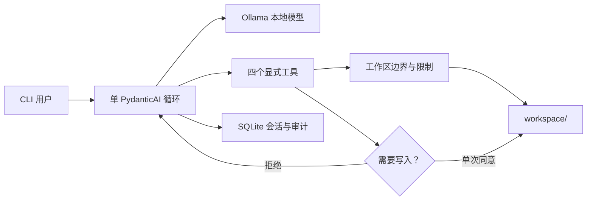

# Minimal Local Agent

**一个本地模型、一个 Agent 循环、四个受限工具，以及一份审计记录。**

[English](README.md)

Minimal Local Agent 是一个极简、默认本地运行的 AI Agent 参考实现。它通过
PydanticAI 调用 Ollama 模型，用 SQLite 保存会话，并且只向模型开放限定工作区内
的文件工具。

> 当前状态：早期 Alpha。安全边界由代码强制执行，但本地模型仍可能出错；请检查
> 每一次写入请求。

## 核心特点

- 单 Agent，不包含路由 Agent、规划层或隐藏子 Agent
- Ollama 本地模型与原生工具调用
- CLI 单次任务及交互聊天
- SQLite 持久化会话、消息历史和工具审计信息
- 文件列表、读取、纯文本搜索，以及经确认后的写入
- 拒绝绝对路径、目录穿越和工作区外的符号链接目标
- 限制模型回合、工具调用、输出长度、文件大小和搜索范围
- 不提供删除、Shell、网络请求和任意 Python 执行能力
- TOML 配置、环境变量覆盖、单元测试及 GitHub Actions

## 快速开始

需要 Python 3.11+ 和本地运行的 [Ollama](https://ollama.com/)。默认模型是
`qwen3.5:9b`；显存或内存不足时可改用 `qwen3.5:4b`。

### Windows PowerShell

```powershell
git clone https://github.com/MuzeAnisichael/minimal-local-agent.git
Set-Location minimal-local-agent
py -3.11 -m venv .venv
.\.venv\Scripts\Activate.ps1
python -m pip install -e ".[dev]"
ollama pull qwen3.5:9b
Copy-Item agent.example.toml agent.toml
minimal-agent doctor
minimal-agent chat
```

### macOS / Linux

```bash
git clone https://github.com/MuzeAnisichael/minimal-local-agent.git
cd minimal-local-agent
python3.11 -m venv .venv
source .venv/bin/activate
python -m pip install -e ".[dev]"
ollama pull qwen3.5:9b
cp agent.example.toml agent.toml
minimal-agent doctor
minimal-agent chat
```

## 使用方式

执行一次任务：

```bash
minimal-agent run "总结工作区中的 Markdown 文件"
```

启动或恢复聊天：

```bash
minimal-agent chat
minimal-agent chat --session 20260808-120000-a1b2c3
```

查看本地记录：

```bash
minimal-agent sessions
minimal-agent history 20260808-120000-a1b2c3
```

模型只能访问 `workspace/` 中的文件。每次请求写入时，CLI 都会显示目标路径、内容
大小和是否覆盖，然后要求一次性确认；非交互环境会自动拒绝写入。

## 架构



| 工具 | 是否有副作用 | 主要限制 |
|---|---:|---|
| `list_files` | 否 | 相对路径、安全 glob、结果上限 |
| `read_file` | 否 | UTF-8 文本、文件大小上限 |
| `search_text` | 否 | 纯文本、扫描文件数及结果上限 |
| `write_file` | 是 | 人工确认、UTF-8、原子写入、大小上限 |

## 配置

复制 `agent.example.toml` 为 `agent.toml`。后者已被 Git 忽略。

```toml
[agent]
model = "qwen3.5:9b"
base_url = "http://localhost:11434/v1"
request_limit = 6
tool_calls_limit = 8
max_output_tokens = 2048
temperature = 0.1

[paths]
workspace = "workspace"
database = ".minimal-local-agent/state.db"
```

相对路径以配置文件所在目录为基准。主要环境变量如下：

| 环境变量 | 含义 |
|---|---|
| `MLA_CONFIG` | 配置文件路径 |
| `MLA_MODEL` | Ollama 模型名称 |
| `MLA_BASE_URL` | Ollama 的 OpenAI 兼容地址 |
| `MLA_WORKSPACE` | Agent 可访问的工作区根目录 |
| `MLA_DATABASE` | SQLite 文件路径 |
| `MLA_REQUEST_LIMIT` | 单次任务最大模型请求数 |
| `MLA_TOOL_CALLS_LIMIT` | 单次任务最大工具调用数 |
| `MLA_MAX_OUTPUT_TOKENS` | 单次任务最大输出 token 数 |

完整变量列表请见英文版 [README](README.md#configuration)。

## 安全边界

模型输出始终视为不可信输入，即使模型在本地运行：

1. 绝对路径和工作区外路径会被拒绝。
2. 已存在的符号链接会先解析，再检查边界。
3. 文件、搜索、模型回合和工具调用均有固定上限。
4. 所有写入都需要交互确认；非 TTY 环境默认拒绝。
5. 写入通过同目录临时文件及原子替换完成。
6. Agent 无法删除文件、执行命令或访问网络。
7. 运行结果和工具元数据写入本地 SQLite，便于复核。

不要把用户主目录、多个项目的上级目录或包含密钥的宽泛目录配置成工作区。更多信息
见 [SECURITY.md](SECURITY.md)。

## 开发与测试

```bash
python -m pip install -e ".[dev]"
ruff check .
pytest
```

单元测试不需要 Ollama；本地模型集成可使用 `minimal-agent doctor` 检查。

## 后续方向

- 流式输出，同时保持完整审计
- 可选的只读 MCP 工具
- 面向本地模型的任务评测集
- 长会话上下文压缩
- CLI 稳定后再提供可选 HTTP API

多 Agent、向量数据库、Shell 和 Web UI 都不是默认方向，只有出现可测量需求时才引入。

## 许可证

[MIT](LICENSE)
