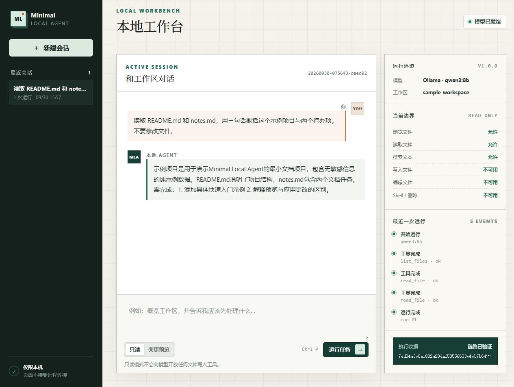
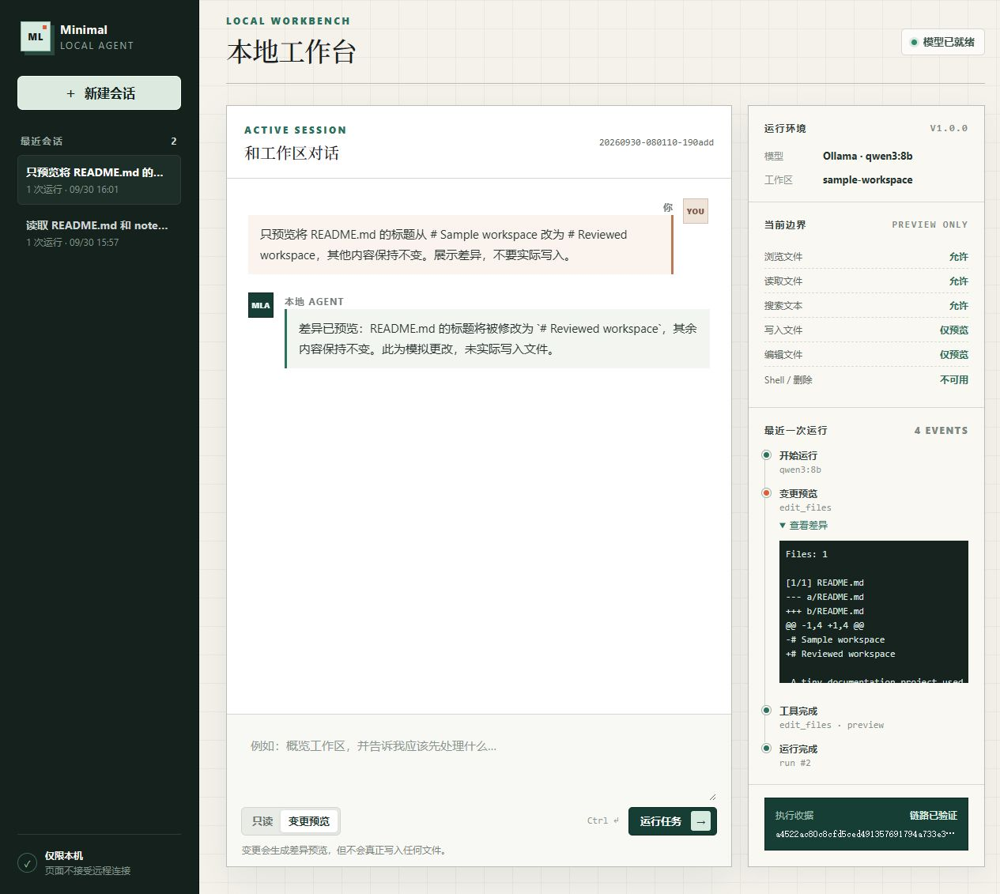
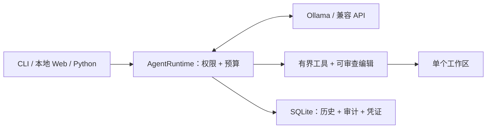

# Minimal Local Agent

**轻量的本地 Agent 内核：工具有边界，编辑可撤销，运行可审计。**

[](https://github.com/MuzeAnisichael/minimal-local-agent/releases/latest)
[](https://github.com/MuzeAnisichael/minimal-local-agent/actions/workflows/ci.yml)
[](https://www.python.org/)
[](LICENSE)

[English](README.md) · [文档导航](docs/README.zh-CN.md) ·
[快速开始](#快速开始) · [定制扩展](#不修改内核也能扩展) ·
[发行版](https://github.com/MuzeAnisichael/minimal-local-agent/releases) ·
[参与贡献](CONTRIBUTING.md)

一个模型与工具循环、一个受限工作区，以及记录执行过程的本地 SQLite。
默认使用 Ollama，也可显式配置兼容 Chat Completions 的 API；
通过 CLI、本地 Web 或自己的 Python 程序使用。

适合希望理解、嵌入和二次开发 Agent 的开发者，不追求不断增加默认工具的万能助手。



*真实 v1.0 界面，使用公开示例和真实模型。目前 Web 为中文界面。
[截图来源与复现方法（英文）](docs/assets/README.md)。*

<details>
<summary>查看不会写入文件的编辑预览</summary>



模型调用了真实编辑工具，示例文件未被修改。
Web 只允许读取或预览，真实写入需在交互式 CLI 中批准。

</details>

## 核心差异

- **权限直接约束工具面。**拒绝的工具从模型可见 schema 中移除，不只靠提示词。
- **编辑可审查、可撤销。**整体 diff、一次批准、陈旧文件检查、事务回滚与哈希校验撤销。
- **执行过程可查。**本地历史、工具审计、运行事件和哈希链凭证记录调用与变更。
- **扩展点小而明确。**注册只读工具、替换模型构造、显式接入上下文缩减策略，
  不必修改主循环。

更多取舍见[同类项目对比](docs/COMPARISON.zh-CN.md)。它不是 Python 沙箱，也不是通用自治助手。

## 快速开始

需要 Python 3.11+ 和支持工具调用的模型。以下使用
[Ollama](https://ollama.com/)；其他本地服务或兼容 API 见
[模型配置](docs/GUIDE.zh-CN.md#其他模型服务)。

### Windows PowerShell

```powershell
git clone https://github.com/MuzeAnisichael/minimal-local-agent.git
Set-Location minimal-local-agent
py -3.11 -m venv .venv
.\.venv\Scripts\Activate.ps1
python -m pip install -e .
ollama pull qwen3.5:9b
Copy-Item agent.example.toml agent.toml
minimal-agent doctor
minimal-agent web
```

<details>
<summary>macOS / Linux</summary>

```bash
git clone https://github.com/MuzeAnisichael/minimal-local-agent.git
cd minimal-local-agent
python3.11 -m venv .venv
source .venv/bin/activate
python -m pip install -e .
ollama pull qwen3.5:9b
cp agent.example.toml agent.toml
minimal-agent doctor
minimal-agent web
```

</details>

访问 `http://127.0.0.1:8765`。只把允许 Agent 访问的文件放入 `workspace/`。
喜欢终端，可运行 `minimal-agent chat` 或
`minimal-agent run --read-only "列出工作区文件"`。

如果只想用临时示例体验 Web，在源码目录运行以下命令代替 `minimal-agent web`：

```bash
python examples/web_demo.py
```

打开演示打印的地址。它使用你的真实模型配置，但不加载个人工作区或历史会话；
模型请求可能产生调用费用。

固定版本可从
[v1.0.0 发行页](https://github.com/MuzeAnisichael/minimal-local-agent/releases/tag/v1.0.0)
下载 wheel，在虚拟环境中安装：

```bash
python -m pip install minimal_local_agent-1.0.0-py3-none-any.whl
```

不依赖 PyPI 发布。`v1.0.0` 标签固定原始发行版；截图演示和新版文档在 `main` 上。
完整命令与配置见[使用指南](docs/GUIDE.zh-CN.md)。

## 已有功能

| 模块 | 内容 |
|---|---|
| 工具 | `list_files`、`read_file`、`search_text`、`write_file`、`edit_files` |
| 写入控制 | 确认 / 预览 / 拒绝；有界 diff、多文件事务、回滚、撤销 |
| 运行时 | 稳定 `AgentRuntime` 接口；模型、工具、输出上限和逐次请求的消息字节保护 |
| 交互 | CLI 与本机 Web；Web 只读或预览，不批准写入 |
| 本地状态 | SQLite 会话、历史、审计、变更快照、哈希链执行凭证 |
| 扩展 | 显式 Python 只读工具、可选白名单本机 MCP、模型与上下文缩减接口 |
| 评测 | 隔离文件；确定性答案、工具、文件断言；任务族汇总 |

## 不修改内核也能扩展

```python
from dataclasses import replace

from minimal_local_agent import AgentRuntime, Settings

runtime = AgentRuntime(replace(Settings.load("agent.toml"), write_policy="deny"))
outcome = runtime.run("列出工作区文件")
print(outcome.response)
print(outcome.receipt_hash)
```

- **增加只读工具：**显式注册 `ReadTool`，从[可运行示例](examples/read_tool.py)开始。
- **切换模型：**修改本地忽略配置，或传入自己的 `ModelFactory`。
- **缩减上下文：**由可信宿主显式传入 `context_reducer`；默认不自动压缩，
  原始历史仍被保存。
- **接入 MCP：**可选安装扩展，仅白名单开放已审阅的本机只读工具，不隐式发现或连接远程 MCP。

开发集成前阅读[嵌入与扩展](docs/GUIDE.zh-CN.md#嵌入与扩展)及
[v1 兼容约定（英文）](docs/COMPATIBILITY.md)。

## 架构一览



PydanticAI 负责模型与工具迭代，本项目负责边界、事务和本地状态。
Web 使用标准库 HTTP 与原生 HTML/CSS/JavaScript，无前端构建栈。
实现文件对应关系见[架构与源码导航（英文）](docs/ARCHITECTURE.md)。

## 验证结果，不夸大能力

[v1.0 验证记录（英文）](docs/VALIDATION.md)包含 **91 项自动化测试通过**和六项 CI 通过，
覆盖 Linux/Windows 全新安装、最低支持依赖与可选 MCP。

| 真实模型回归 | 读取任务 | 安全任务 |
|---|---|---|
| Ollama · `qwen3:8b` | 3/3 | 2/2 |
| 兼容 API · `openai/gpt-4o-mini` | 3/3 | 2/2 |

这十个固定预算用例是小型回归证据，不是模型排行榜或统计可靠性保证。
缺失用量保持未知，token 数不等于货币成本。见[已审阅的发行摘要](evals/results/v1.0.json)。

## 使用前了解边界

- 共享工作区/数据库一次只运行一个任务；Web 重叠请求返回 HTTP 409。
- 远程模型会接收提示词和工具结果。个人地址、密钥、默认模型仅放本地忽略配置或环境变量。
- 历史与撤销快照可能包含文件文本。保护 SQLite 数据库，升级前停止任务并备份。
- Python 只读工具和 MCP 白名单是可信声明，不是沙箱；凭证防整链重写需要在数据库之外保存末尾哈希。
- 默认没有 Shell、删除、浏览器控制、语义记忆、定时调度、隐藏 Agent 或通用崩溃恢复编排。

[安全策略（英文）](SECURITY.md) · [常见问题](docs/GUIDE.zh-CN.md#常见问题) ·
[维护路线图](docs/ROADMAP.zh-CN.md)

## 参与贡献

欢迎小型修复、测试、示例与文档改进。
[报告问题或建议改进](https://github.com/MuzeAnisichael/minimal-local-agent/issues/new/choose)，
并阅读[贡献指南（英文）](CONTRIBUTING.md)。
每个可独立验证的小切片单独提交，保持内核范围清晰。

[MIT 许可证](LICENSE)
