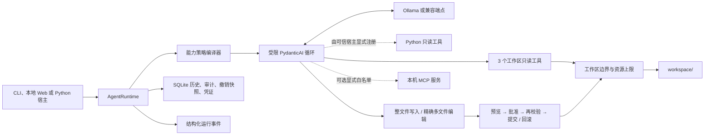

# Minimal Local Agent

**一个极简、可审计的本地 Agent 内核：单模型循环、显式能力、可撤销编辑，并且没有 Shell。**

[English](README.md) · [同类项目对比](docs/COMPARISON.zh-CN.md) ·
[验证记录](docs/VALIDATION.md) · [路线图](docs/ROADMAP.zh-CN.md) ·
[v1 兼容与升级](docs/COMPATIBILITY.md) · [安全策略](SECURITY.md)

Minimal Local Agent 默认通过 PydanticAI 调用 Ollama，也可显式接入兼容 OpenAI Chat
Completions 的服务。文件工具被限制在一个工作区内，SQLite 保存会话、审计事件、
可撤销变更和哈希链执行凭证。

当前版本为 `1.0.0` 稳定版，定位是能力有界的轻量内核。1.x 保持文档约定的扩展签名与
数据兼容。边界由运行时代码执行；模型输出和配置的 MCP 服务仍应视为不可信输入。
稳定版不意味着每种服务商与模型都有相同表现。

## 核心差异

- 策略会改变模型实际可见的工具 schema，而不只是修改提示词。
- 多文件编辑先整体暂存和展示 diff，只批准一次，再校验并以事务方式提交或回滚。
- 已应用变更可查看、可撤销；如果文件后来被修改，撤销会安全拒绝。
- 每次运行都会产生结构化事件和哈希链执行凭证。
- MCP 为可选能力，只允许回环地址、显式工具白名单、名称前缀和结果大小限制。
- 核心不提供 Shell、删除、浏览器控制、后台守护进程和隐藏子 Agent。

更完整的取舍见[同类项目对比](docs/COMPARISON.zh-CN.md)。

## v1.0 能力

| 范围 | 已实现 |
|---|---|
| 运行时 | 稳定的 `AgentRuntime` 嵌入接口、可替换模型工厂、受限单 Agent 循环 |
| 上下文 | 逐次请求的消息字节预算；预留显式压缩接口，默认不自动压缩 |
| 定制 | 显式注册、受权限与审计约束的 Python 只读工具 |
| 模型 | 默认 Ollama；可选择兼容 OpenAI Chat Completions 的端点 |
| 界面 | 本地 Web 控制台与 CLI；Web 任务仅可只读或预览 |
| 只读工具 | `list_files`、`read_file`、`search_text` |
| 变更工具 | `write_file`、事务式 `edit_files` |
| 变更安全 | 统一 diff、确认/预览/拒绝、陈旧检查、回滚、撤销 |
| 策略 | 逐工具 allow/deny，拒绝能力从工具面机械移除 |
| 可观测性 | SQLite 审计、JSONL 事件、哈希链执行凭证 |
| 扩展 | 可选、显式白名单的本机 HTTP MCP 客户端 |
| 评测 | 按任务族汇总结果，确定性检查答案、工具与文件产物 |

## 快速开始

需要 Python 3.11+ 和支持工具调用的模型。以下快速开始采用默认的
[Ollama](https://ollama.com/)。

若只需要固定版本，可从
[v1.0.0 发行页](https://github.com/MuzeAnisichael/minimal-local-agent/releases/tag/v1.0.0)
下载 wheel，在虚拟环境中运行
`python -m pip install minimal_local_agent-1.0.0-py3-none-any.whl`。
不依赖 PyPI 发布。下方克隆方式便于二次开发；如需固定版本，安装前切换至 `v1.0.0` 标签。

### Windows PowerShell

```powershell
git clone https://github.com/MuzeAnisichael/minimal-local-agent.git
Set-Location minimal-local-agent
py -3.11 -m venv .venv
.\.venv\Scripts\Activate.ps1
python -m pip install -e .
ollama pull qwen3.5:9b
Copy-Item agent.example.toml agent.toml
minimal-agent doctor
minimal-agent chat
# 也可以打开本地 Web 控制台
minimal-agent web
```

### macOS / Linux

```bash
git clone https://github.com/MuzeAnisichael/minimal-local-agent.git
cd minimal-local-agent
python3.11 -m venv .venv
source .venv/bin/activate
python -m pip install -e .
ollama pull qwen3.5:9b
cp agent.example.toml agent.toml
minimal-agent doctor
minimal-agent chat
# 也可以打开本地 Web 控制台
minimal-agent web
```

只把允许 Agent 访问的文件放入 `workspace/`。

## 本地 Web 控制台

启动浏览器工作台，然后访问 `http://127.0.0.1:8765`：

```bash
minimal-agent web
```

Web 控制台支持只读运行、不会落盘的变更预览、会话历史、运行事件和收据链状态。
服务只监听本机，并且不会开放需要确认的真实写入；如需查看完整差异并批准写入，
请使用交互式 CLI。它适配窄屏，但定位仍是本机界面，不应作为公网服务暴露。

Web 一次只接受一个运行中的任务，重叠请求返回 HTTP 409。CLI/Python 宿主也应串行运行
共享工作区/数据库的任务；独立工作区使用独立数据库。

## 常用命令

```bash
# 单次任务或交互会话
minimal-agent run "总结工作区中的 Markdown 文件"
minimal-agent chat

# 移除变更工具，或只预览不落盘
minimal-agent run --read-only "审查这个项目"
minimal-agent run --dry-run "修改 README.md 标题"

# 在 stderr 输出 JSONL 运行事件
minimal-agent run --events "查找发布说明"

# 查看真实生效的能力与审计记录
minimal-agent capabilities
minimal-agent sessions
minimal-agent history SESSION_ID
minimal-agent audit SESSION_ID --json

# 查看和撤销一次文件事务
minimal-agent changes
minimal-agent change CHANGE_SET_ID
minimal-agent undo CHANGE_SET_ID

# 查看并校验执行凭证链
minimal-agent receipts SESSION_ID --json
minimal-agent verify SESSION_ID --head LAST_RECEIPT_HASH
```

交互式写入会对完整且有上限的 diff 请求一次批准；非交互环境会自动拒绝确认式写入。
`--dry-run` 展示同样的 diff，但绝不修改文件。

## 架构



PydanticAI 负责模型和工具迭代；本项目代码负责能力注册、工作区边界、变更事务、策略、
持久化与凭证。模型无法在运行时自行增加工具或绕过缺失的 schema。

## 配置

复制 `agent.example.toml` 为被 Git 忽略的 `agent.toml`：

```toml
[agent]
provider = "ollama"
model = "qwen3.5:9b"
base_url = "http://localhost:11434/v1"
request_limit = 6
tool_calls_limit = 8
max_output_tokens = 2048
max_context_bytes = 64000 # 序列化消息字节数，不是模型 token 数
temperature = 0.1
write_policy = "confirm" # "confirm"、"preview" 或 "deny"

[paths]
workspace = "workspace"
database = ".minimal-local-agent/state.db"

[tools]
max_file_bytes = 200000
max_transaction_files = 8
max_diff_chars = 40000
max_mcp_result_chars = 100000

[policy.tools]
# search_text = "deny"
# edit_files = "preview"
# count_files = "deny" # 已注册的 Python 只读工具
```

所有标量配置都支持 `MLA_*` 环境变量覆盖，常用项包括 `MLA_PROVIDER`、
`MLA_MODEL`、`MLA_BASE_URL`、`MLA_API_KEY_ENV`、`MLA_WORKSPACE`、
`MLA_DATABASE`、`MLA_WRITE_POLICY`、
`MLA_DISABLED_TOOLS` 和各个 `MLA_MAX_*` 上限。相对路径以配置文件目录为基准。

配置优先级为默认值 → TOML → 环境变量。未知 TOML 字段和错误类型会明确报错，
不再静默忽略；正确的 v0.9 配置仍然有效。升级已有数据库前，停止任务并备份，
具体支持范围见[兼容与升级说明](docs/COMPATIBILITY.md)。

### 接入其他模型服务

本地服务器、官方 API 或中转站只要提供兼容 OpenAI Chat Completions 的接口，
就可以在**被 Git 忽略的** `agent.toml` 中配置：

```toml
[agent]
provider = "openai-compatible"
model = "your-tool-capable-model"
base_url = "https://your-provider.example/v1"
api_key_env = "MODEL_API_KEY"
```

在本机环境变量 `MODEL_API_KEY` 中放入实际密钥，然后运行 `minimal-agent doctor`
及一个只读任务。`api_key_env` 填的是**环境变量名称**，不是密钥。无密钥的本地兼容
服务可省略它，使用回环或私有网络地址。远程端点需要密钥；带密钥的非回环端点必须
使用 HTTPS。`doctor` 只探测 `/models`，不会发起生成请求；没有模型列表接口的
服务可能显示“未验证”，需通过任务验证。

此适配器面向 Chat Completions 和工具调用，并不保证支持每个服务的专有扩展；
模型不支持兼容工具调用时，任务可能失败。真实地址、密钥和个人默认模型只保存在
本地配置或环境变量中。使用远程服务时，提示词和工具结果（包括 Agent 读取的
工作区内容）会发送给该服务。

写工具只能是 `ask`、`preview` 或 `deny`，不能配置成绕过批准；只读和外部只读工具只能
是 `allow` 或 `deny`。

### 上下文预算

`max_context_bytes` 在**每次模型请求前**检查待发送消息的 UTF-8 JSON 字节数，
包括工具返回后的后续请求。这是跨模型的保守保护，**不是**精确 token 计数，也不保证
一定适配服务商的上下文窗口；工具 schema 等服务商封装不在此计数内。超限时明确失败，
大小和哈希写入执行凭证，已保存的完整会话不会被裁剪。可开启新会话或通过本地配置、
`MLA_MAX_CONTEXT_BYTES` 调整上限。

可信 Python 宿主未来可显式向 `AgentRuntime` 传入 `context_reducer=` 接入压缩策略。
它必须保留最新消息、输出不超过预算的模型视图，并保持工具调用与结果配对；运行时
记录缩减视图的大小和哈希，SQLite 仍保存原始完整历史。本版不内置自动摘要，也不会
从 TOML 动态导入压缩代码。

## Python 只读工具扩展

配置好支持工具调用的模型后，直接运行最小示例：

```bash
python examples/read_tool.py
```

示例通过 `ReadTool("count_files", count_files)` 向 `AgentRuntime` 显式注册工具，
并强制只读。若要在本地 Web 页面中使用同一个工具，可在 Python 脚本中调用
`serve_web(settings, read_tools=(ReadTool("count_files", count_files),))`。
无需修改 Agent 核心，也不会从 TOML 动态导入代码。

在 `[policy.tools]` 中设置 `count_files = "deny"` 后，该工具不会进入模型可见的
工具表。允许的调用会受现有 `max_mcp_result_chars` 外部结果上限约束；审计和收据
只存参数名/哈希及结果大小/哈希，不存完整参数或结果。模型会话历史仍可能包含完整
工具结果。`ReadTool` 是**可信代码的只读声明，不是 Python 沙箱**：只注册已审阅、
确实执行读取的函数。完整代码见 [examples/read_tool.py](examples/read_tool.py)。

旧的 `AgentRuntime(toolsets=..., external_tools=...)` 入口可绕过权限与审计，现已移除；
请迁移到 `read_tools=(ReadTool(...),)`。

## 可选 MCP 客户端

```bash
python -m pip install -e ".[mcp]"
```

```toml
[[mcp.servers]]
name = "notes"
url = "http://127.0.0.1:8000/mcp"
allow_tools = ["search_notes", "read_note"]

[policy.tools]
mcp_notes_read_note = "deny"
```

模型看到的是 `mcp_notes_search_notes` 这类带前缀名称。MCP 客户端只接受 `localhost`、
`127.0.0.1` 或 `::1`；关闭服务端指令、采样、交互请求、文件系统根目录、隐式工具暴露和
远程 URL。工具结果有大小上限，审计仅保存参数名和参数哈希，不保存完整参数。

白名单代表操作者确认这些工具是只读的。MCP 注解和服务端内容本身不是安全边界，因此只应
连接可信本机服务，并保持最小白名单。

## Python 嵌入与事件

```python
from minimal_local_agent import AgentRuntime, Settings

runtime = AgentRuntime(Settings.load("agent.toml"))
outcome = runtime.run(
    "总结 fact.txt",
    event_handler=lambda event: print(event.to_dict()),
)
print(outcome.response)
print(outcome.receipt_hash)
```

运行事件包括 `run.started`、`tool.completed`、`mutation.preview`、
`mutation.applied`、`run.completed` 和 `run.failed`。宿主可通过 `model_factory` 替换模型
构造，也可显式注册可信只读工具。观察回调失败不会改变 Agent 运行语义，错误会出现在
`outcome.event_handler_errors` 中。
稳定的宿主接口、配置、数据库升级和数据格式见[v1 兼容约定](docs/COMPATIBILITY.md)。

执行凭证记录端点/提示词/回复哈希、用量、有效能力清单和适合审计的工具元数据，并按会话
组成哈希链。内部校验能发现断链或未重算哈希的内容修改；把最后一个哈希另存到 SQLite
之外，再用 `verify --head` 校验，还能发现整链重写或截断。如果没有外部 head，能够写数据库
的人也能重算整条链。凭证不等同于数字身份或远程证明。

## 模型评测

```bash
# 内置 list/read/search 隔离测试
minimal-agent eval --model qwen3:4b --model qwen3:8b

# 外部版本化数据集
minimal-agent eval --dataset evals/adversarial.json --model qwen3:8b
```

JSON schema 仍为 `minimal-local-agent.eval-dataset.v1`。用例可声明任务族 `family`、
隔离初始文件 `files`、预期工具/状态/回复、禁止工具，以及精确文件内容
`expected_files` 和不应存在的文件 `absent_files`。产物检查读取真实隔离工作区，
不依赖模型自述。JSON 报告使用 `minimal-local-agent.eval-report.v1`，记录版本、服务类型
和固定预算，按任务族列出成功率、每成功任务总耗时和 token；用量缺失或全为零时
token 指标显示未知，不伪装成货币价格。这是兼容性与回归测试，不是通用智能排行榜。
发行评测摘要见 [evals/results/v1.0.json](evals/results/v1.0.json)。

## 安全边界

运行时强制执行：

1. 所有相对路径都限制在一个解析后的工作区，包含符号链接检查；
2. 消息字节、模型请求、工具调用、输出、文件、搜索、事务、diff 和 MCP 结果都有上限；
3. 被拒绝的能力从模型工具表中机械移除；
4. 精确唯一替换、可选源文件哈希和陈旧状态检查；
5. 变更前展示统一 diff，随后原子写入，失败时回滚；
6. 只有当前文件哈希仍匹配时才允许撤销；
7. 内核没有 Shell、进程执行、删除工具、浏览器或远程 MCP；
8. 本地保存历史、审计元数据、结构化事件与可校验凭证。

SQLite 消息历史可能包含模型读过的文件内容；撤销快照会保存变更前文本，请保护数据库。
不要把用户主目录或包含密钥的宽泛目录设置为工作区。详见 [SECURITY.md](SECURITY.md)。

## 开发

```bash
python -m pip install -e ".[dev,mcp]"
ruff format --check .
ruff check .
pytest
```

单元测试不需要 Ollama；`minimal-agent doctor` 检查真实服务，`minimal-agent eval` 测试真实
本地模型。

## 有意不做的事情

核心不以“万能个人助理”为目标。Shell/浏览器工具、语义记忆、定时调度、后台自治和
多 Agent 编排不属于 v1.0。后续工作以[路线图](docs/ROADMAP.zh-CN.md)中的维护和
小型宿主适配为主，不靠增加默认工具来扩大内核。

## License

[MIT](LICENSE)
