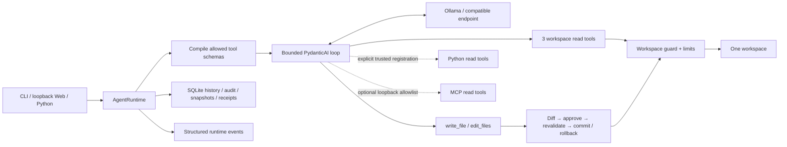

# Architecture

[Documentation](README.md) · [v1 host contract](COMPATIBILITY.md) · [Security](../SECURITY.md)

One bounded model/tool loop sits inside a local, synchronous runtime. PydanticAI
owns iteration; project code owns permissions, file boundaries, reversible edits,
state, and receipts. CLI, Web, and Python hosts use the same runtime.

## Source map

| Responsibility | Main files |
|---|---|
| Runtime, dependencies, bounded iteration | [agent.py](../src/minimal_local_agent/agent.py); [runtime.py](../src/minimal_local_agent/runtime.py) is a public re-export |
| Settings and replaceable model construction | [config.py](../src/minimal_local_agent/config.py), [models.py](../src/minimal_local_agent/models.py) |
| Per-request context guard and explicit reducer | [context.py](../src/minimal_local_agent/context.py) |
| Tool visibility and file confinement | [policy.py](../src/minimal_local_agent/policy.py), [security.py](../src/minimal_local_agent/security.py), [workspace.py](../src/minimal_local_agent/workspace.py) |
| Diff, approval, transactions, rollback, undo | [mutations.py](../src/minimal_local_agent/mutations.py) |
| Audited host extensions | [read_tools.py](../src/minimal_local_agent/read_tools.py), [mcp.py](../src/minimal_local_agent/mcp.py) |
| Persistence, migrations, receipts, events | [store.py](../src/minimal_local_agent/store.py), [events.py](../src/minimal_local_agent/events.py) |
| Interfaces and evaluation | [cli.py](../src/minimal_local_agent/cli.py), [web.py](../src/minimal_local_agent/web.py), [web_assets](../src/minimal_local_agent/web_assets), [evals.py](../src/minimal_local_agent/evals.py) |

## Mechanisms that matter

- **Capability policy:** denied tools are absent from the actual model schema.
  Global read-only/preview limits cannot be lifted by per-tool overrides.
- **Context:** every request checks serialized message bytes. Default overflow
  rejects; an explicit host reducer can change only the model view. It is not an
  exact token budget, automatic summarizer, or memory database.
- **Mutations:** bounded full writes or exact unique replacements are staged,
  diffed, approved once, rechecked for stale files, and committed. Rollback handles
  in-process transaction failures; undo requires matching current hashes. This is
  not crash-safe general checkpoint orchestration or recovery for arbitrary tools.
- **State:** SQLite stores history, run results, tool metadata, change snapshots,
  and chained receipts. Atomic migrations preserve supported old data; future
  schemas are refused. Only one active task per shared workspace/database is supported.
- **Observation:** runtime callbacks and JSONL CLI events expose progress. A
  receipt chain needs a separately saved final hash for strong rewrite/truncation
  detection; it is not a signature or remote attestation.
- **Web:** standard-library HTTP plus plain HTML/CSS/JavaScript; no frontend build
  stack. Loopback, Host/origin checks, and read/preview modes keep its scope narrow.
- **Evaluation:** isolated fixtures and deterministic tool/answer/file assertions
  check behavior. Task families report fixed-budget smoke evidence, not model self-grading.

## Extension boundary

Use `ReadTool`, `ModelFactory`, `ContextReducer`, or an explicitly allowlisted local
MCP server before proposing a new core module. Host Python functions and MCP
allowlists are trusted declarations, not sandboxes. Remote model calls transmit
prompts and tool results; "local-first" does not mean remote data never leaves.

The five built-in tools remain list, read, search, write, and exact edit. Shell,
deletion tools, browser control, background scheduling, semantic memory, hidden
sub-agents, and broad recovery orchestration are deliberate non-goals. See the
[roadmap](ROADMAP.md) and [capability admission rule](COMPARISON.md#admission-rule-for-new-capabilities).
